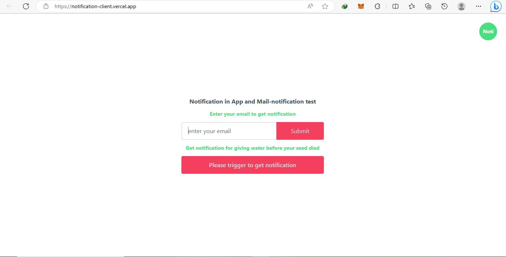
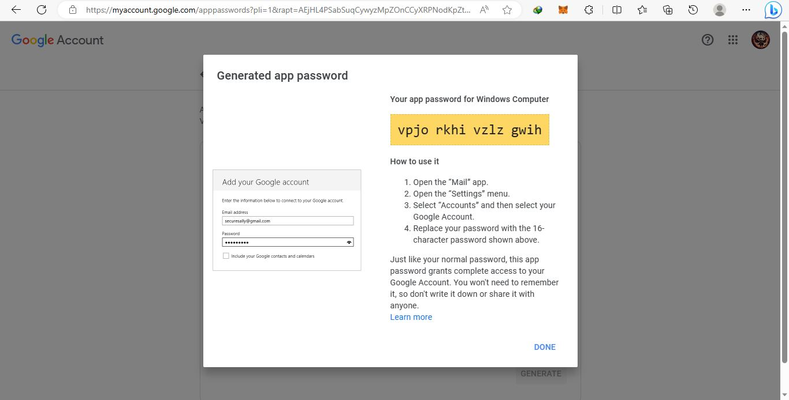

This is a Notification in App and Mail-notification test with [`npm create vite@latest`](https://vitejs.dev/guide/).



What I test following:

- Realtime notification with [socket.io](https://socket.io/) which connection with client and server(web-2 & web-3)
- Send to gmail when getting notification with [nodemailer](https://nodemailer.com/about/)

### Prerequisites

**Node version 14.x**

### Cloning the repository

```shell
git clone https://github.com/leopico/Notification-server.git
```

### Install packages

```shell
npm i
```

### Setup .env file

```js
PORT=3001
GMAIL_USER=
GMAIL_PASS=
HOST_CLIENT=https://notification-client.vercel.app
```

### For GMAIL_USER

- This is your gmail (eg: abc@gmail.com)

### For GMAIL_PASS



### Start the app

```shell
npm run start
```

### Time to Go Client Side

- [Click to go client side](https://notification-client.vercel.app/)
